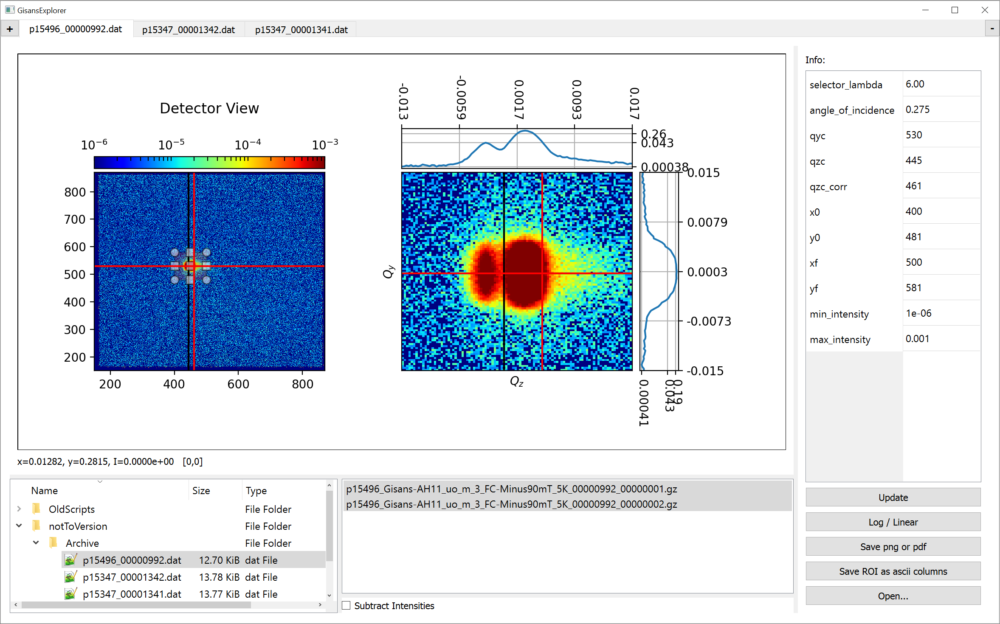

# NeutronDataViewer

Simple **GUI** that interactively helps in the reduction of NNICOS GISANS data.



# Install:
```
 $ git clone https://github.com/juanmcloaiza/NeutronDataViewer.git
 $ cd NeutronDataViewer
 ```
 
 **Use Python 3.7** from here on:
 
 Linux:
 ```
 $ python -m venv ./GisansExplorerEnv
 $ source ./GisansExplorerEnv/bin/activate
```

Windows:
```
 $ python -m venv .\GisansExplorerEnv
 $ python -m venv --system-site-packages GisansExplorerEnv
 $ python -m venv --upgrade GisansExplorerEnv
 $ .\GisansExplorerEnv\Scripts\activate
```

# Run:
```
 $ python GisansExplorer.py
```

**N.B.** Should requirements not be satisfied, run the following in the terminal:
```
 $ pip install --upgrade pip
 $ pip install -r requirements.txt  
 ```
