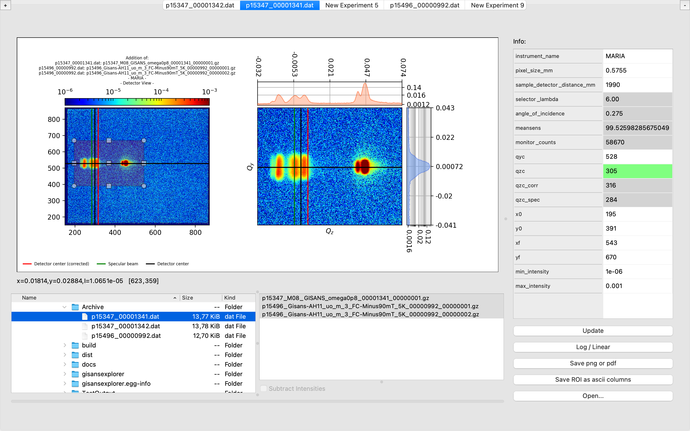

# gisans-X-plorer

Simple App that interactively helps in the reduction of [NICOS](https://nicos-controls.org/) files for [GISA(N|X)S](http://www.gisaxs.de/theory.html) data.



# Install - Windows, Mac, Linux; [Python 3.6](https://realpython.com/installing-python/)


Open a terminal and use ``pip``:

```
$ pip install gisansexplorer
```

# Run:

Once installed, open a terminal and simply call ``gisansexplorer``:

```
$ gisansexplorer
```

# [How To...](https://gisansexplorer.readthedocs.io/en/latest/howto.html)

https://gisansexplorer.readthedocs.io/

---
Developed by [Juan M. Carmona Loaiza](https://github.com/juanmcloaiza/) - [MLZ Scientific Computing Group](http://apps.jcns.fz-juelich.de/doku/sc/start), in collaboration with [Alexandros Koutsioumpas](https://alexandros-koutsioumpas.weebly.com/index.html).